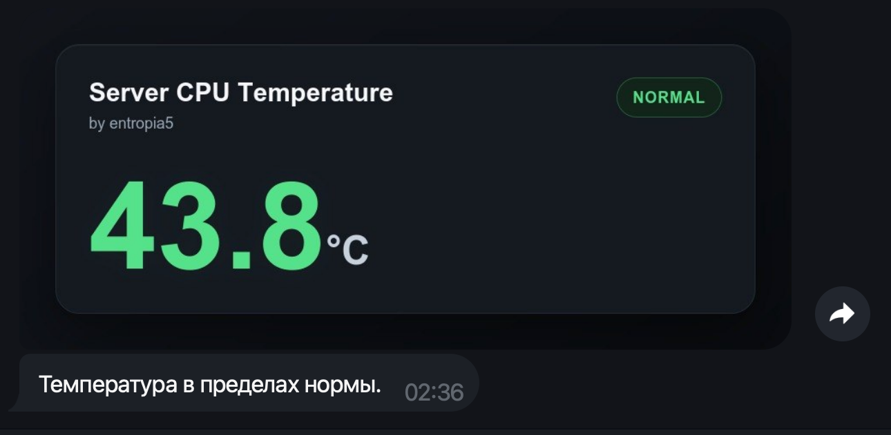
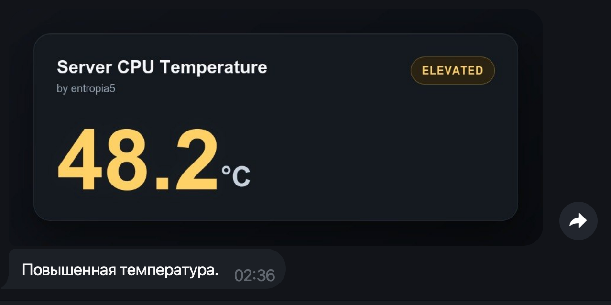
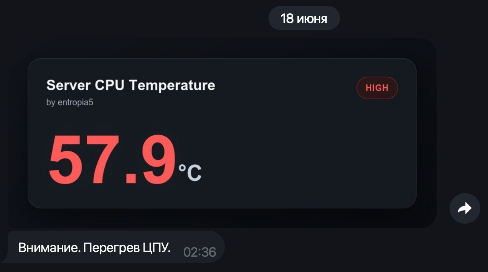

# TemperatureBot

TemperatureBot is a small C++17 Telegram bot for Raspberry Pi and Linux boards.
It reads CPU temperature from `/sys/class/thermal/thermal_zone0/temp`, renders a
dark graphite HTML/CSS dashboard image, and keeps one live Telegram screen
updated without chat spam.



## Screenshots

### Elevated



### High



## Features

- Live Telegram dashboard rendered as a JPEG image from HTML/CSS
- Dark graphite UI with color-coded temperature
- Companion text status message without duplicated temperature numbers
- No-spam updates through `editMessageMedia` and `editMessageText`
- Persistent `bot_state.json` so the bot can reuse live message IDs after restart
- `/start` command triggers a self-restart through `execv`
- Runtime render files are cleaned after upload
- Optional systemd service deployment

## Temperature States

The thresholds are defined in `temperature_bot.cpp`:

```cpp
const float TEMP_WARNING = 45.0f;
const float TEMP_ALARM = 50.0f;
const auto REPORT_INTERVAL = std::chrono::minutes(5);
const auto ELEVATED_REPORT_INTERVAL = std::chrono::seconds(15);
const auto SENSOR_INTERVAL = std::chrono::seconds(15);
```

Behavior:

- below `45.0 C`: green, `Температура в пределах нормы.`
- `45.0 C` to `49.9 C`: yellow, `Температура повысилась.`
- `50.0 C` and higher: red, `Внимание. Перегрев ЦПУ.`
- state changes are sent immediately
- normal update interval: every 5 minutes
- elevated/high update interval: every 15 seconds
- sensor check interval: every 15 seconds

## Requirements

- Linux with `/sys/class/thermal/thermal_zone0/temp`
- C++17 compiler
- libcurl development package
- `wkhtmltoimage`
- Telegram bot token
- Telegram chat ID

On Raspberry Pi OS or Debian/Ubuntu:

```bash
sudo apt update
sudo apt install g++ make libcurl4-openssl-dev wkhtmltopdf
```

## Telegram Setup

1. Create a bot with `@BotFather`.
2. Copy the bot token.
3. Send any message to your bot.
4. Get your chat ID:

```bash
curl "https://api.telegram.org/botYOUR_BOT_TOKEN/getUpdates"
```

Look for `message.chat.id` in the response.

## Configuration

Copy the example environment file:

```bash
cp .env.example .env
```

Edit `.env`:

```env
BOT_TOKEN=your_telegram_bot_token
CHAT_ID=your_telegram_chat_id
```

Never commit `.env`. It contains secrets.

## Build

```bash
make
```

Equivalent manual command:

```bash
g++ -std=c++17 -Wall -Wextra -O2 temperature_bot.cpp -lcurl -pthread -o temperature_bot
```

## Run

```bash
./temperature_bot
```

The bot creates or updates a Telegram live dashboard and a companion status
text message. It stores runtime Telegram message IDs in `bot_state.json`.

## Self-Restart

Send `/start` to the bot from the configured `CHAT_ID`.

The bot stores the latest Telegram update id, then replaces its own process with
`execv(argv[0], argv)`. This reloads the binary from disk without calling
`systemctl restart`.

Systemd is still useful as a safety net if the process crashes or cannot read
Telegram updates.

## systemd

An example unit is available at:

```text
deploy/systemd/bot-temperature.service.example
```

Copy and edit it for your machine:

```bash
sudo cp deploy/systemd/bot-temperature.service.example /etc/systemd/system/bot-temperature.service
sudo nano /etc/systemd/system/bot-temperature.service
sudo systemctl daemon-reload
sudo systemctl enable bot-temperature
sudo systemctl start bot-temperature
```

Check logs:

```bash
journalctl -u bot-temperature -f
```

## Runtime Files

These files are generated locally and should not be committed:

- `.env`
- `temperature_bot`
- `bot_state.json`
- `bot_state.json.tmp`
- `runtime/`

## Repository Files

- `temperature_bot.cpp` - main bot source
- `.env.example` - environment template
- `Makefile` - local build helper
- `assets/normal.png` - normal temperature preview
- `assets/screenshots/alarm2.png` - elevated temperature preview
- `assets/screenshots/alarm1.png` - high temperature preview
- `deploy/systemd/bot-temperature.service.example` - systemd template
- `example_temperature_bot_plus_fan.cpp` - experimental fan-control example

## License

MIT
